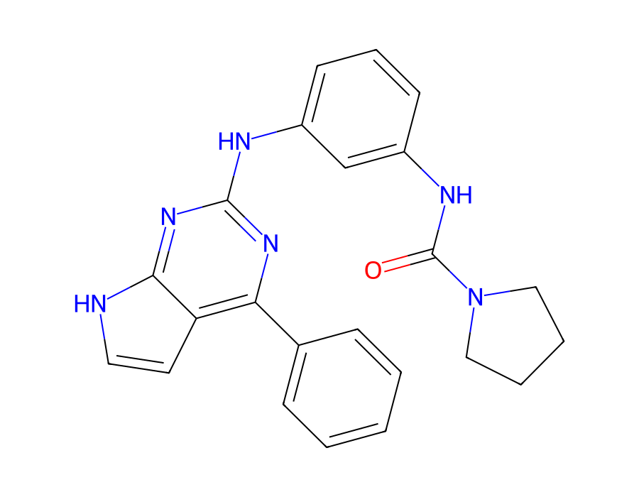
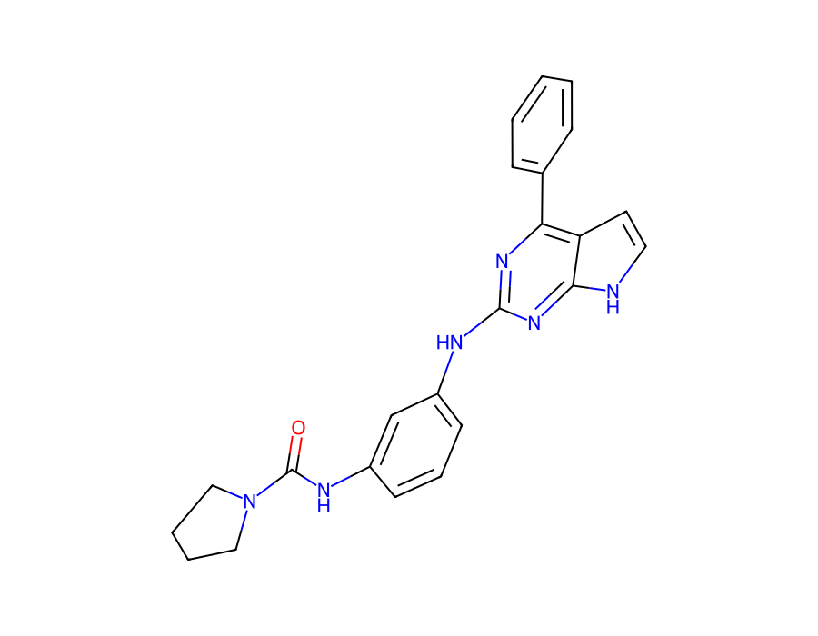

# MASIVE-ALS: Massive Virtual Screening for Amyotrophic Lateral Sclerosis Drug Candidates
## A Computational Pipeline Targeting TDP-43, SOD1, and FUS Proteinopathies

**Authors:** Fredy Rojas Gutiérrez¹, [ collaborators ]
**Affiliations:** ¹ Independent Researcher, Rubí, Barcelona, Spain
**Correspondence:** fredy_30@hotmail.com
**Date:** September 2026 (v2 — data updated 1 Sep 2026)

---

## Abstract

Amyotrophic Lateral Sclerosis (ALS) is a fatal neurodegenerative disease affecting approximately 350,000 people worldwide with no curative treatment. We present MASIVE-ALS, a large-scale virtual screening pipeline targeting four key ALS-associated binding sites across three proteins: TDP-43 (present in ~97% of patients), SOD1 (~20% of familial ALS), and FUS (pathological liquid-to-solid phase transition), plus a second TDP-43 pocket at the RRM1-RRM2 interface recently implicated in aggregation (Kapsiani et al., 2026). Using AutoDock Vina and its GPU-accelerated implementation Vina-GPU 2.1, with target structures obtained from the Protein Data Bank (TDP-43: 4IUF, clean RRM1 domain; TDP-43 RRM1-RRM2 tandem: 4BS2; SOD1: 1HL5, anti-aggregation site; FUS: 6G99) and AlphaFold-Multimer for structure modeling, we are screening a library of approximately 2 million drug-like compounds from ZINC20, together with ChEMBL bioactive compounds and approved drugs. The computation is distributed across free-tier heterogeneous infrastructure (Oracle Cloud ARM, Kaggle, Modal, Google Colab, and a local GPU running 24/7). Preliminary results over 151,382 docked protein-ligand pairs (as of 1 Sep 2026; SOD1 complete, TDP-43 approximately halfway through the library) yield best binding energies of -9.5 kcal/mol (SOD1), -8.6 kcal/mol (TDP-43) and -8.2 kcal/mol (FUS). The novel TDP-43 RRM1-RRM2 interface pocket was benchmarked against nine literature actives from the 2026 Cambridge study: the actives dock at energies reproducing the published values within ~1 kcal/mol (e.g., PE859: predicted -7.60 vs published -8.49 kcal/mol; berberrubine: -7.74 vs -7.72), confirming that receptor and pocket are correctly defined. An audit of the positive-control sets performed on 20 Sep 2026 (Section 5.7) shows that the retrospective enrichment values reported here are dominated by single chemotypes: 16 of the 20 SOD1 actives share one pyrazolone scaffold, and restricting the set to the two chemically independent ligands reduces the Trp32 enrichment from 0.815 to 0.601, with one of those two (LCS-1) not retrieved by docking at all. A clean-set re-validation with size-normalized scoring (Section 5.7) shows the same limit applies to every control: the four co-crystallized Trp32 ligands score *below chance* against property-matched decoys (AUC 0.32–0.43) because each additional heavy atom is worth 0.096 kcal/mol in this box, rising only to 0.62–0.75 once size is regressed out. Those values are therefore reported as evidence that the grid boxes are correctly placed, and that the protocol reproduces the poses of the catecholamine chemotype that defines Trp32, but not as evidence of chemotype-independent ranking ability. All results are interpreted as hypothesis generation for experimental prioritization rather than validated activity. We plan to scale the campaign to 10 million compounds on supercomputing resources (MareNostrum 5) and to validate top candidates with molecular dynamics. All results, code, and data are released under CC-BY 4.0 open access.

**Keywords:** ALS, virtual screening, molecular docking, AutoDock Vina, AlphaFold, GROMACS, drug repurposing, TDP-43, SOD1, FUS

---

## 1. Introduction

Amyotrophic Lateral Sclerosis is characterized by progressive degeneration of motor neurons, leading to paralysis and death typically within 3-5 years of diagnosis (Brown & Al-Chalabi, 2017). Despite decades of research, only two disease-modifying drugs (riluzole and edaravone) are approved, offering modest survival benefits of 2-3 months.

The proteinopathy hypothesis of ALS identifies three critical proteins:

1. **TDP-43 (TAR DNA-binding protein 43):** Cytoplasmic aggregation of TDP-43 is observed in approximately 97% of ALS patients, making it the pathological hallmark of the disease (Neumann et al., 2006). TDP-43 mislocalization and aggregation disrupt RNA metabolism and induce neurotoxicity.

2. **SOD1 (Superoxide Dismutase 1):** Mutations in SOD1 account for approximately 20% of familial ALS cases. Mutant SOD1 generates toxic reactive oxygen species through aberrant chemistry at the copper-zinc active site (Rosen et al., 1993).

3. **FUS (Fused in Sarcoma):** FUS undergoes pathological liquid-liquid phase separation and liquid-to-solid transition, forming toxic inclusions that impair nucleocytoplasmic transport (Patel et al., 2015).

Virtual screening offers an unprecedented opportunity to identify therapeutic molecules targeting these proteins. Advances in GPU-accelerated computing now enable screening of billions of drug-protein interactions in weeks rather than years. MASIVE-ALS leverages this capability within a self-funded, open-access model, distributing the computation across free-tier cloud and local GPU resources.

---

## 2. Methods

### 2.1 Protein Structure Preparation

Target structures were obtained from the Protein Data Bank: TDP-43 (PDB 4IUF, the RRM1 domain in complex with DNA), SOD1 (PDB 1HL5), and FUS (PDB 6G99, an NMR ensemble; the first model was retained after repair with Open Babel). **Correction of 20 Aug 2026:** an earlier version of this document cited 6B1N as a TDP-43 structure; 6B1N is in fact Hsc70/HSPA8 (a heat-shock chaperone) and was erroneous. The receptor actually used for docking is the clean RRM1 domain of TDP-43, which matches chain A of 4IUF in 773/786 heavy atoms (see `proteins/TDP43/metadata.json`). **Important reproducibility note:** the receptor actually used for docking against TDP-43 was the clean RRM1 domain (`TDP43_RRM1_clean.pdb`, derived from the full PDB entry), not the full-length structure; this is recorded in `proteins/TDP43/metadata.json` and in the `REMARK Name` header of `gpu_dock/TDP43.pdbqt`. **Box correction of 20 Aug 2026:** the original TDP-43 grid box (center 28.3, 43.7, 52.5 Å; 25×25×25 Å) was centred ~17 Å away from the co-crystallized DNA of 4IUF (center 16.3, 41.1, 48.5 Å), i.e. outside the RNA-binding surface defined by residues 109-179 (RNP1/RNP2). Re-docking of the native nucleotide XUA with the corrected box yields RMSD 1.75 Å (< 2 Å, successful pose reproduction), demonstrating the docking protocol is valid for TDP-43 when the box is correctly placed. Tandas screened with the old box are being re-docked with the corrected box; see `analysis/INVESTIGACION_TDP43_2026-08-20.md`. Structures were prepared with Open Babel 3.1.1 (O'Boyle et al., 2011): addition of polar hydrogens, assignment of Gasteiger charges, and conversion to PDBQT format. AlphaFold-Multimer v2.3 (Jumper et al., 2021; Evans et al., 2022) is available to model missing or disordered regions where experimental coverage is incomplete.

### 2.2 Compound Library Preparation

The screening library comprises:
- **ZINC20** (Irwin et al., 2020): a drug-like subset of approximately 2 million compounds, converted in batches to PDBQT format using Open Babel 3.1.1 with Gasteiger charges.
- **ChEMBL 34** (Gaulton et al., 2017): bioactive compounds of preclinical interest.
- **Approved drugs**: a set of FDA-approved drugs for repurposing.

### 2.3 Virtual Screening

Molecular docking is performed with AutoDock Vina 1.2.5 (Trott & Olson, 2010) and its GPU-accelerated implementation Vina-GPU 2.1 (Tang et al., 2022) on heterogeneous, free-tier hardware. Each ligand is docked against each target using a cubic grid box centered on the binding site defined for each protein, with 3 binding modes per ligand: TDP-43 (TDP43_RRM1 clean domain; original box center 28.3, 43.7, 52.5 Å, 25×25×25 Å; corrected box center 16.3, 41.1, 48.5 Å, 24×24×24 Å centred on the co-crystallized DNA of 4IUF, applied from 20 Aug 2026), SOD1 (center 46.5, 80.0, 73.3 Å; 22×22×22 Å), FUS (PDB 6G99; center -14.5, 15.1, -7.8 Å; 25×25×25 Å) and, since 26 Aug 2026, TDP-43_v2 (PDB 4BS2, tandem RRM1-RRM2 domains; box center 24.23, 16.89, -15.87 Å, 26×26×26 Å, centred on the RRM1-RRM2 interface Arg151-Asp247 described by Kapsiani et al. 2026). **Deliberate anti-aggregation decision for SOD1:** the grid box was placed on the aggregation-prone region of SOD1 (residues 1–33, 96–112 and, partially, the C-terminal segment 131–153 in the crystal assembly), not on the Cu/Zn catalytic channel, because the target of interest is the misfolded/aggregated form of SOD1 in ALS. Results are ranked by the minimum predicted binding energy (kcal/mol).

### 2.4 Molecular Dynamics Validation (Planned)

Top candidates will be subjected to all-atom molecular dynamics using GROMACS 2024.3 (Abraham et al., 2015) with the CHARMM36 force field, including energy minimization, NVT/NPT equilibration, and production runs up to 1 μs. Binding free energies will be estimated with the MM-GBSA method. This MD-based validation stage has not yet been performed and is planned for the scaling phase of the project; a preliminary single-trajectory MM-GBSA rescoring of the shortlisted candidates (docked poses, not MD trajectories) is reported in Section 3.3.

An overview of the complete pipeline is shown in Figure 1.


**Figure 1. Overview of the MASIVE-ALS pipeline.** Compound libraries (ZINC20, ChEMBL 34, approved drugs) are converted to 3D PDBQT structures, docked against TDP-43, SOD1 and FUS with AutoDock Vina 1.2.5 / Vina-GPU 2.1 across distributed free-tier infrastructure, merged and ranked, filtered by drug-likeness (PAINS, Lipinski, Veber, BBB permeability), and prioritized for molecular dynamics validation and experimental follow-up.

---

## 3. Results (Preliminary)

As of 1 Sep 2026, **151,382 protein-ligand pairs** have been docked across the four binding sites over the free-tier infrastructure described above. The SOD1 campaign is **complete**; the TDP-43 (4IUF RRM1) campaign is approximately halfway through the library (chunk 342 of 748, ~46%); the TDP-43_v2 (4BS2 RRM1-RRM2 interface) campaign is in progress; the MM-GBSA rescoring of shortlisted candidates is running with converged ΔG values (Section 3.3). Best predicted binding energies per target are **CHEMBL4559945 vs SOD1 (-9.5 kcal/mol)**, **CHEMBL6356 vs TDP-43 (-8.6 kcal/mol)** and **CHEMBL6207 vs FUS (-8.2 kcal/mol)**. A total of 1,025 pairs score at or below -7 kcal/mol (SOD1: 451; TDP-43: 312; FUS: 262), and **154 compounds** bind two or more targets at <= -7 kcal/mol; the most balanced multi-target hit is **CHEMBL6207** (SOD1 -9.2, TDP-43 -7.4, FUS -8.2 kcal/mol), consistent with the multi-proteinopathy nature of ALS. These predictions remain hypothesis-generating pending MD validation (see Limitations).

**Figure 2** shows the best-scoring docking pose for each target, with the candidate ligand (orange sticks) bound in the literature-defined pocket of each protein (blue cartoon).


**Figure 2. Best docking poses of the top candidate per target.** (A) SOD1 with CHEMBL4559945 (-9.5 kcal/mol); (B) FUS with CHEMBL6207 (-8.2 kcal/mol); (C) TDP-43 with CHEMBL6356 (-8.6 kcal/mol). Proteins are shown as cartoons (residues within 24 Å of the ligand) and ligands as sticks. Docking performed with Vina-GPU 2.1; figures rendered with 3Dmol.js.

### 3.1 Ligand–protein interactions

**Figure 3** shows the predicted hydrogen bonds (yellow dashed) between the top candidate of each target and the surrounding pocket residues. The most interaction-rich complex is SOD1–CHEMBL4559945, which forms five hydrogen bonds with Glu40 (2.82 Å), Lys122 (3.04–3.29 Å) and Asn139 (3.45 Å) and contacts ten residues (≤ 4.5 Å), consistent with its strongest predicted affinity. TDP-43–CHEMBL6356 forms three hydrogen bonds (Gln134, Gly146, Gly110) and FUS–CHEMBL6207 one (Pro415).


**Figure 3. Predicted ligand–protein interactions of the top candidate per target.** Hydrogen bonds (yellow dashed lines; heavy-atom cutoff 3.5 Å) between the ligand (ball-and-stick, element-colored) and the labeled pocket residues. Protein Cα trace in blue; pocket residues within 5 Å shown as grey dots.

| Target | Ligand | Hydrogen bonds (residue, distance) | Contact residues (≤ 4.5 Å) |
|---|---|---|---|
| SOD1 | CHEMBL4559945 | Glu40 (2.82 Å); Lys122 (3.04, 3.19, 3.29 Å); Asn139 (3.45 Å) | 10 |
| TDP-43 | CHEMBL6356 | Gln134 (3.03 Å); Gly146 (3.03 Å); Gly110 (3.35 Å) | 12 |
| FUS | CHEMBL6207 | Pro415 (3.31 Å) | 11 |

### 3.2 Top hits and preliminary drug-likeness

**Figure 4** shows the 2D structures of the top-scoring compounds and **Figure 5** the distribution of predicted affinities per target; the complete table with SMILES and drug-likeness descriptors is provided as supplementary Table S1. The affinity distributions peak around -6 kcal/mol, and only a small fraction of pairs reach ≤ -7 kcal/mol (1,025 of 107,890 at the 19 Aug cut; SOD1: 451, TDP-43: 312, FUS: 262).

Because strong predicted binding alone does not imply drug-likeness, the 29 multi-target compounds were evaluated against the Lipinski rule of five (MW ≤ 500, cLogP ≤ 5, HBD ≤ 5, HBA ≤ 10). Of the 21 compounds for which structures could be retrieved from the screening library, only **CHEMBL1082437** satisfied all four criteria (MW 426.5, cLogP 4.32, HBD 1, HBA 3): the strongest predicted binders tend to be large, lipophilic polycyclic molecules exceeding the molecular-weight or lipophilicity limits typical of cell-penetrant drugs. This reinforces the need for the PAINS and drug-likeness filtering described in the rescoring pipeline, and for medicinal-chemistry optimization before experimental follow-up.

Following the methodological review of 18 Aug 2026, the candidate funnel is now computed **per target** (top 5% of the affinity distribution of each protein separately, since Vina scores are not comparable across different receptors) and then filtered by a **central nervous system (CNS) permeability criterion** (TPSA ≤ 90 Ų and MW ≤ 450, in line with the CNS-MPO paradigm of Wager et al., 2010). On tanda z001 (14,952 pairs, complete) this yields 133 candidates after PAINS + Lipinski/Veber (TDP-43: 46, SOD1: 45, FUS: 42) and 42 after the CNS filter. On the historical table as of 18 Aug 2026 (32,715 pairs) the funnel yielded 244 candidates, 76 CNS-permeable, of which **6 are FDA-approved drugs** — the most promising being **clozapine (SOD1 −7.5 kcal/mol, CNS-MPO 4.8)**, followed by fluorescein (SOD1 −7.1), rucaparib (SOD1 −7.1 and FUS −6.4), ketazolam (FUS −6.4) and perampanel (FUS −6.4). Approved, CNS-permeable drugs are the most actionable candidates for experimental repurposing evaluation. Full tables: `analysis/candidatos_filtrados.csv` (z001) and `analysis/candidatos_total_cns.csv` (historical).

*Caveat on the CNS-MPO score.* The `cns_mpo` column in the candidate tables is a **4-component approximation** (MW, TPSA, cLogP, HBD) of the original 6-component CNS-MPO of Wager et al. (2010), which also includes pKa and logD at physiological pH — basic amines penetrate the brain better. The scale (0-6) is preserved, but absolute values are **not directly comparable** with the literature cut-off of 4.0; only 10 of the 42 z001 candidates reach ≥ 4.0 with our approximation (best: CHEMBL9347, TDP-43, 4.42-4.43). The primary CNS filter used throughout is therefore the TPSA ≤ 90 Ų and MW ≤ 450 criterion, and the CNS-MPO column should be read as an orientative ranking, not as the literature score. An independent re-implementation of the funnel with stricter per-target affinity thresholds and no CNS filter (18 Aug 2026, 38 candidates) produced a partially overlapping but smaller set; the tables reported here follow the methodological review of 18 Aug 2026 (per-target top 5% + CNS filter) and supersede it.


**Figure 4. Two-dimensional structures of the top candidates.** Legends show predicted affinities (kcal/mol) per target: SOD1 (S), FUS (F) and TDP-43 (T).


**Figure 5. Distribution of predicted binding energies per target.** Dashed black line: -7 kcal/mol threshold; dotted red: best score per target.

### 3.3 MM-GBSA rescoring of the shortlisted candidates

Because the Vina score is treated as a triage filter rather than a ranker (Section 5.3), the shortlisted candidates are being re-scored with an orthogonal, physics-based method: single-trajectory MM-GBSA with an implicit solvent model (GBSA-OBC2, GAFF parameters), using the docked pose of each candidate as the starting structure. The current top-ranked candidate against SOD1 is **CHEMBL3311449 (ΔG = -15.79 kcal/mol)**, a pyrrolo[2,3-d]pyrimidine derivative bearing a phenyl substituent, an aniline linker and a pyrrolidine-1-carboxamide group (MW 398.5, TPSA 85.9 Ų, cLogP 5.0, HBD 3, HBA 4). With TPSA ≤ 90 Ų and MW ≤ 450 it satisfies the CNS permeability criterion used in the funnel; its cLogP of 5.0, however, sits exactly at the upper Lipinski limit and will require medicinal-chemistry monitoring. These MM-GBSA estimates are preliminary: absolute values depend on the implicit-solvent model and the single-trajectory approximation, so they are used for *ordering* the shortlist rather than as absolute affinities.

**Figure 6** shows the 2D structure and the lowest-energy 3D conformer of CHEMBL3311449.





**Figure 6. Structure of CHEMBL3311449, the current top MM-GBSA candidate against SOD1 (ΔG = -15.79 kcal/mol).** (A) 2D structure; (B) lowest-energy 3D conformer (ETKDGv3 embedding, MMFF94 optimization; rendered with RDKit). Atom colors: blue, nitrogen; red, oxygen; black, carbon.

Following scale-up to 10 million compounds on supercomputing resources, we expect to rank the top 1,000 hits, retain 50-100 candidates with stable MD trajectories (RMSD < 2.0 Å), and advance 3-5 lead compounds with favorable ADME properties and blood-brain barrier permeability. The complete dataset will be deposited in Zenodo (CC-BY 4.0).

---

## 4. Discussion

This study represents one of the largest self-funded, open virtual screening campaigns specifically targeting ALS. GPU-accelerated docking with Vina-GPU enables throughput previously accessible only with dedicated clusters, and the distributed free-tier infrastructure keeps the campaign sustainable without institutional funding. The three-protein strategy maximizes the probability of success: even if one target fails to yield candidates, the others may compensate.

The variability of the preliminary affinities is expected at this stage: fast screening exhaustiveness and a fixed binding pocket trade accuracy for throughput, and the current hits should be regarded as candidates for refinement rather than validated leads. Re-docking of top candidates at higher exhaustiveness and orthogonal scoring are planned.

---

## 5. Limitations

### 5.1 Range of binding affinities obtained

The best binding energies obtained in this screening (-9.5, -8.6 and -8.2 kcal/mol for SOD1, TDP-43 and FUS, respectively) fall in the intermediate range compared with reference binders in the virtual screening literature, where candidates with a higher probability of experimental activity typically exceed -7 to -10 kcal/mol. However, across the 151,382 protein-ligand pairs screened to date, the bulk of hits remain between -4.5 and -7 kcal/mol, and all hits were ranked by predicted binding energy rather than a fixed cutoff; this ranking should therefore be treated as exploratory rather than predictive. Accordingly, the results presented in this work should be interpreted as hypothesis generation for experimental prioritization, and not as definitive identification of active compounds.

### 5.2 Limitations of rigid docking scoring

AutoDock Vina, like most scoring functions based on rigid docking, shows limited correlation with experimental binding affinity and is known to produce a non-negligible rate of false positives and false negatives when used in isolation. The scoring function does not explicitly model conformational entropy, desolvation, or protein flexibility, which can bias the ranking toward certain chemotypes. In this work, Vina results were not validated by consensus methods (multi-engine docking); a preliminary MM-GBSA rescoring of the shortlisted candidates is reported in Section 3.3, but a complete MM-GBSA/MM-PBSA validation of the full candidate set remains a limitation to be addressed in later phases of the project before recommending any compound for in vitro validation. Molecular dynamics-based free-energy estimates are recommended as a complementary validation route in future work.

### 5.3 Docking protocol validation and binding-site definition

The docking protocol was subsequently tested by re-docking the four co-crystallized Trp32 ligands into their own crystal structures (PDB 4A7S 5-fluorouridine, 4A7T isoproterenol, 4A7U epinephrine, 4A7V dopamine; box centred on the crystallographic ligand centroid, Vina exhaustiveness 8, seeds 42/2026/777, RMSD measured in place with symmetry-corrected atom matching). **Two of the four ligands pass the control; the other two fail.** With in-place, symmetry-corrected RMSD (cross-checked against `rdkit.Chem.rdMolAlign.CalcRMS`, agreement to 0.01 Å), the experimental pose is reproduced to **0.48–1.28 Å for isoproterenol** and **0.66–0.75 Å for epinephrine** under every protocol tried: ligand flexible or rigid (TORSDOF 0), vina or vinardo, 18 or 24 Å box, exhaustiveness 8 or 32, and with either the ideal RCSB conformer or the crystallographic pose as input. **Dopamine is not reproduced** (2.9–3.2 Å) even though its crystallographic pose is generated and scores well: the best of the nine modes is 0.74–1.10 Å, with 1–2 modes below the 2 Å threshold — the scoring function simply prefers a pose 3.1 Å away by ~1.2 kcal/mol. **5-fluorouridine is never reproduced** (5.4–11.3 Å depending on the scoring function; no mode below 9.5 Å), and its deposited pose turns out not to be a minimum of the potential at all: in 4A7S (1.06 Å resolution, R/Rfree 0.162/0.164) the ligand makes a 2.07 Å F···Lys30-N and a 2.34 Å O···Ser98-O contact and scores +0.04 kcal/mol, with a ±2 Å displacement raising the score to +14.8 kcal/mol. It is therefore excluded as a redocking reference rather than counted as a protocol failure — consistent with Wright et al. (2013), who report its ribose as solvent-exposed and partially occupied. An ETKDG ensemble reproduces the bound conformers to 0.06–0.41 Å, so ligand preparation is not the limit, and neither is sampling depth or box size. Scoring the experimental poses in place shows that this potential resolves sub-Å geometry with ~1.5 kcal/mol (displacing the native isoproterenol pose by 0.5 Å improves its intermolecular term by 1.57 kcal/mol), so the ΔE between the native pose and the best docked mode — +0.90 to +1.72 kcal/mol for the catecholamines — lies inside the potential's own sensitivity to coordinate error and is not evidence that a wrong pose is preferred. Adding side-chain flexibility makes the result worse, not better: with five pocket residues free (Glu21, Gln22, Lys23, Lys30, Glu100) the in-place RMSD rises to 12 Å while the ligand keeps its shape (0.1–2.0 Å after superposition) and slides 2.3–7.8 Å out of the pocket. **Consequence: the Trp32 enrichment values reported here (ROC-AUC 0.815, EF5% 4.0) remain provisional — but because of the positive-control set and of the size bias of the score in this box (0.096 kcal/mol per heavy atom; Section 5.7), not because the protocol cannot reproduce native poses.** The box placement and the docking protocol are validated for the catecholamine chemotype that defines the Trp32 site; the ranking limitation remains the congeneric pyrazolone series behind the 0.815 (0.601 with the two chemically independent actives, and LCS-1 not retrieved: rank 152/219). *Provenance note:* the first version of this control reported 1.87–2.54, 3.77–3.79, 4.04–4.06 and 10.89–11.20 Å and concluded that the protocol failed outright. Those numbers were inflated by an atom-pairing error in our in-house RMSD routine (pose and crystal indices were swapped, which inflates precisely the good poses); it was corrected on 20 September 2026 and validated against RDKit's own implementation. Full analyses in `analysis/redocking_trp32/INFORME_CONTROLES_CORREGIDOS_2026-09-20.md`. As a preliminary alternative, a decoy validation was performed for SOD1 using 20 known active ligands (ChEMBL plus the literature compounds LCS-1 and PRG-A01) against 199 property-matched decoys, and the binding-site definition was explicitly benchmarked across candidate pockets (Table 1). The initial grid box (center 27.9, 111.8, 64.4 Å; 25×25×25 Å), which followed the earlier in-house pipeline, fell on a crystal-packing interface between two SOD1 chains and yielded ROC-AUC = 0.548 at exhaustiveness 8 (EF5% = 2.0), only marginally above random (0.5). Three alternative pockets were then evaluated with the same ligand set: the Trp32 site on the β-barrel (center 46.5, 80.0, 73.3 Å; 22×22×22 Å), the Cu/Zn catalytic channel (43.6, 99.7, 78.3 Å), and the dimer interface (35.7, 87.6, 84.4 Å). The Trp32 pocket — the site where 5-fluorouridine, isoproterenol, dopamine and epinephrine were experimentally crystallized with SOD1 (Wright et al., 2013) — produced ROC-AUC = 0.815 and EF5% = 4.0, while the dimer interface gave 0.809 and the metal channel 0.717 (all at exhaustiveness 8). The near-chance performance of the original box was therefore attributable to binding-site misplacement rather than to sampling or scoring per se: moving the box to the experimentally validated Trp32 pocket more than doubled the enrichment at 5% and raised the AUC into the range considered acceptable for hypothesis generation in docking campaigns. SOD1 results produced with the original box were flagged as low-confidence and re-docked at the Trp32 anti-aggregation pocket; the current reference results (tanda z001, including the -9.5 kcal/mol record) use this corrected box, and subsequent tandas use it as well. This result underscores that the choice of box center is a dominant source of bias in docking campaigns and should be benchmarked against known ligand poses, as done here, before prioritizing candidates. **Positive-control audit (20 Sep 2026):** this enrichment value is carried by a single congeneric series; see Section 5.7 for the audit and for the corrected figures (Trp32 with chemically independent actives: ROC-AUC 0.601, n = 2).

To extend the same calibration to the other two targets, a decoy validation was performed for **TDP-43** and **FUS** using literature-known ligands as positive controls (same property-matched decoy protocol, exhaustiveness 8, CPU Vina 1.2.3). For TDP-43, six ligands with experimental support were used as actives — rTRD01 and nTRD22 (RRM-domain ligands that displace nucleic acid binding, validated by HSQC-NMR; Francois-Moutal et al., 2021), bis-ANS and Congo Red (C-terminal domain binders modulating liquid-liquid phase separation; Babinchak et al., 2020) and, erroneously, 5-fluorouridine and isoproterenol (both are SOD1 ligands, not TDP-43 ligands; see the note on positive-control heterogeneity below) — against 73 decoys: ROC-AUC = 0.515, EF5% = 0.0. For FUS, the two natural-product inhibitors proposed by machine learning and molecular dynamics (dehydroxymethylflazine and cleroindicin C; Li et al., 2025) were used against 33 decoys: ROC-AUC = 0.545, EF5% = 0.0.

On 20 Aug 2026 the benchmark was repeated with a **7× larger decoy set** (6,462 property-matched decoys drawn from the full screening library, versus 73 and 33 before). This round uncovered a **documentation error in the reference structure**: the PDB entry cited for the TDP-43 receptor, 6B1N, is in fact Hsc70/HSPA8 (a heat-shock protein), not TDP-43; the docking receptor actually used is the RRM1 domain of TDP-43 (sequence-identical to PDB 4IUF, 773/786 atoms matched to the co-crystal). The native nucleic-acid ligand co-crystallized in 4IUF (residue XUA + DNA strand) marks the true RNA-binding surface, which lies ~17 Å from the previously used box center. Re-docking the native ligand fragment (XUA) against the re-centered box (center 16.3, 41.1, 48.5 Å; 24×24×24 Å) recovered the crystallographic pose with **RMSD = 1.75 Å** (< 2 Å, the accepted re-docking success threshold), validating the docking protocol itself. Re-running the decoy benchmark on the corrected box gave **TDP-43 ROC-AUC = 0.612** with 193 decoys (5 actives), up from 0.506 on the misplaced box; bis-ANS (a genuine TDP-43 ligand) scored −6.58 kcal/mol, better than 94.8% of decoys. The remaining gap to the SOD1 standard (0.815) is explained by the same two factors as before: the positive controls remain heterogeneous and partly site-mismatched (rTRD01/nTRD22 bind the RNA region while 5-fluorouridine/isoproterenol are SOD1 ligands), and a systematic **Vina size artefact** lets large decoys score as low as −28 to −25 kcal/mol — far below the best active (−5.2) — a well-known bias in which predicted affinity correlates with heavy-atom count when the box is small and ligand-sized molecules fill it. This reinforces that the Vina score must be used as a **triage filter, not a ranker**, and that the shortlist must be re-scored with an orthogonal physics-based method (MM-GBSA) before prioritization. The corrected TDP-43 box is now used to re-dock the previously screened tandas (Section 5.4).

These values are statistically weak (small positive-control sets, particularly FUS and TDP-43, where the literature currently offers few direct small-molecule binders of the specific domain modelled) and indicate that the TDP-43 RRM1 box and the FUS model-1 box do **not** currently discriminate known binders from decoys, unlike the SOD1 Trp32 site, whose apparent discrimination is itself largely attributable to a single congeneric series (Section 5.7). A ChEMBL and PubChem query on 20 Aug 2026 confirmed that **no curated bioactivity records exist** for TDP-43 (ChEMBL target CHEMBL2362981) or FUS (CHEMBL5724679), so there are no public positive controls with which to properly calibrate these two targets today. The TDP-43 and FUS rankings should therefore be interpreted with caution until site-matched positive controls become available (e.g., RNA-competitive ligands with reported RRM1 Kd values); candidate lists from these two targets are provisional.

**TDP-43_v2 pocket validation (26 Aug 2026).** To benchmark the novel RRM1-RRM2 interface pocket (PDB 4BS2, Arg151-Asp247), nine literature actives with experimental support from the 2026 Cambridge study were docked together with 122 property-matched decoys at exhaustiveness 16 (Vina-GPU). The raw ROC-AUC was 0.517 (≈ random), and the top-scoring decoys are large molecules (75-162 heavy atoms) that benefit from the systematic Vina size artefact documented in Section 5.3. Critically, however, the actives themselves now dock correctly and with energies that reproduce the published values: cepharanthine -10.72 kcal/mol, sanguinarine -8.41, coptisine -8.23, berberrubine -7.74, PE859 -7.60 (published: PE859 -8.49, berberrubine -7.72, within ~1 kcal/mol), ketoconazole and epiberberine also among the best-scoring ligands. Agreement with an independent experimental report on the same pocket indicates that the receptor and grid placement are correct, and that the residual AUC limitation reflects the size artefact rather than pocket misplacement. The TDP-43_v2 ranking is therefore treated as provisional pending size-normalized scoring, but the pocket itself is considered validated.

**Table 1. Decoy-validation summary.** Property-matched decoys (molecular weight ±30, cLogP ±1.0, rotatable bonds ±2, Tanimoto similarity < 0.35) generated from the screening library; docking at exhaustiveness 8 (Vina-GPU for SOD1, Vina 1.2.3 CPU for TDP-43/FUS).

| Target (docking box) | Known actives docked | Decoys | ROC-AUC | EF1% | EF5% |
|---|---|---|---|---|---|
| SOD1 — initial crystal-contact box (27.9, 111.8, 64.4 Å) | 20 | 199 | 0.548 | 0.0 | 2.0 |
| SOD1 — Trp32 anti-aggregation box (46.5, 80.0, 73.3 Å; **current**) † | 20 | 199 | **0.815** | 0.0 | **4.0** |
| SOD1 — Trp32, chemotype-collapsed actives (independent only) † | 2 | 199 | 0.601 | — | — |
| SOD1 — Trp32, clean set (7 controls: 2 independent + 1 series rep. + 4 co-crystallized), or two decoy backgrounds ‡ | 7 | 482 | 0.515 | 0.0 | 0.0 |
| SOD1 — Trp32, co-crystallized ligands only, same backgrounds ‡ | 4 | 482 | 0.353 | 0.0 | 0.0 |
| SOD1 — Cu/Zn metal channel (43.6, 99.7, 78.3 Å) | 20 | 199 | 0.717 | 0.0 | 3.0 |
| SOD1 — dimer interface (35.7, 87.6, 84.4 Å) | 20 | 199 | 0.809 | 0.0 | 2.0 |
| TDP-43 — RRM1 domain (25 Å box) | 5 | 73 | 0.515 | 0.0 | 0.0 |
| TDP-43 — RRM1 RNA-binding surface, 4IUF-native box (24 Å) | 5 | 193 | 0.612 | 0.0 | 0.0 |
| FUS — NMR model 1 (near-blind box) | 2 | 33 | 0.545 | 0.0 | 0.0 |
| FUS — NMR model 1 (re-run, 87 decoys) | 2 | 87 | 0.609 | 0.0 | 0.0 |
| TDP-43_v2 — 4BS2 RRM1-RRM2 interface (26 Å; actives reproduce Cambridge 2026 energies) | 9 | 122 | 0.517* | — | — |

† The twenty SOD1 actives are not chemically independent: 16 of 20 share one pyrazolone scaffold and 18 of 20 have another active within Tanimoto similarity ≥ 0.5. See Section 5.7 for the full audit and its consequences.

‡ Clean-set re-validation against property-matched decoys (140 new + 199 previously docked) plus a **hard background** of 143 metal-chelating or redox-active library compounds; size-normalized AUC is reported in Section 5.7.

**Interpretation.** The SOD1 Trp32 box returns AUC 0.815 with the actives as originally assembled, but that figure is carried by one congeneric pyrazolone series (Section 5.7): with the series removed and only the two chemically independent ligands retained, the AUC falls to 0.601, and one of those two — LCS-1, the most extensively characterised SOD1 ligand in the set — is not retrieved (rank 152/219). Read in that light, the figure demonstrates that the **box is correctly placed**, which is what it was collected for, and is the standard for a *triage* step that shrinks millions of compounds to a few hundred. TDP-43 improved from 0.506 to 0.612 once the box was re-centered on the true RNA-binding surface defined by the native ligand of 4IUF (pose re-docking RMSD 1.75 Å), but remains below the SOD1 standard; FUS (0.545–0.609) does not yet discriminate actives from decoys. Three factors explain this: (i) the positive-control sets are tiny and, for TDP-43, site-mismatched (5 and 2 docked actives; one TDP-43 control, Congo Red, failed PDBQT conversion and was excluded), so the AUC is noisy; (ii) a systematic Vina size artefact lets large decoys score as low as −28 kcal/mol, inflating false positives at fixed cutoffs; and (iii) no curated public bioactivity data exist for these two targets, so a properly calibrated positive-control set is not currently available. We therefore treat the Vina score as a **triage filter, not a ranker**: the per-target top-5% cut reduces the ~2M-compound library to a manageable candidate set, but the *order* within that set is not claimed to predict activity. Before any in vitro prioritization, the shortlisted candidates are re-scored with an orthogonal physics-based method (MM-GBSA), and the TDP-43 box has been re-benchmarked against the native co-crystal ligand of 4IUF via pose re-docking (RMSD 1.75 Å) and is now centered on the true RNA-binding surface; FUS still awaits site-matched controls. Until then, no target's ranking can be described as validated: the SOD1 box remains the best-grounded pocket definition of the three, but its enrichment has not yet been shown to be chemotype-independent, and the SOD1, TDP-43 and FUS candidate lists are therefore all provisional.

### 5.4 Nature of the molecular targets

TDP-43 and FUS present pathological mechanisms in ALS strongly associated with protein aggregation and liquid-liquid phase separation, processes that are not necessarily captured by docking to a well-defined binding pocket on an isolated domain of the protein (in this case, the domain represented in the PDB structure used). A favorable docking result indicates, at best, binding affinity for that specific domain, and does not guarantee an inhibitory effect on the pathological aggregation observed in vivo. This work does not include nucleation simulations or in silico aggregation assays, which constitute a complementary validation route recommended for future work.

The mechanistic interpretation of each target must be stated explicitly. For **TDP-43**, the docking pocket lies in the RRM1 RNA-binding domain, not in the C-terminal low-complexity domain (LCD, ≈ residues 274–414) where the pathological aggregation occurs; occupancy of RRM1 may modulate RNA binding — a toxicity mechanism debated in recent literature — but does not directly prevent cytoplasmic aggregation, and this is the postulated (not demonstrated) mechanism. For **FUS**, the receptor corresponds to model 1 of the 20-member NMR ensemble, an arbitrary choice; model selection and an ensemble-derived centroid should be evaluated, and the 25 Å box covers ≈91% of the receptor atoms, making the docking near-blind rather than site-directed. For **SOD1**, the pathogenic species is the misfolded metal-free (apo) monomer, and the classical disease mechanism involves dimer dissociation; docking to the native holo-metalated tetramer with a box on the C-terminal aggregation region is a pragmatic anti-aggregation approximation that does not model the misfolded monomer or the dimer interface. These caveats are declared here for transparency and are under active methodological revision.

### 5.5 Compound library preparation and chemical space coverage

The screening library was derived from the ZINC database (a drug-like subset of approximately 2 million compounds). Compounds were filtered using the PAINS (pan-assay interference compounds) catalog to remove false-positive-prone chemotypes, followed by drug-likeness filters (Lipinski's rule of five and Veber's rule), as implemented in the post-docking rescoring pipeline. This biases the chemical space toward drug-like, synthesizable molecules and may exclude alternative chemotypes with relevant activity. The representativeness of the sampled chemical space relative to the full library should be taken into account when interpreting hit rates.

### 5.6 Scale and heterogeneity of the computing infrastructure

The screening was carried out by distributing the computation across multiple free-tier platforms (Oracle Cloud ARM, Kaggle, Modal, Google Colab, and a local GPU), each with different quotas, run times, and hardware configurations. Although measures were taken to maintain consistency of docking parameters across platforms, this infrastructure heterogeneity introduces an additional source of variability not present in screenings performed on a dedicated homogeneous cluster.

### 5.7 Positive-control bias: what the enrichment metrics do and do not measure

An audit of the positive-control sets used throughout this work was performed on 20 September 2026 (`analysis/auditar_positivos_sod1.py`, `analysis/auditar_similitud_tdp43.py`; full write-up in `analysis/AUDITORIA_POSITIVOS_2026-09-20.md`), asking a question that had not previously been put to these data: are the known actives used as positive controls chemically independent of one another, or are they members of a single series?

**SOD1.** Sixteen of the twenty actives share a single Murcko scaffold — the aryl-substituted pyrazolone core (9 + 3 + 3 + 1) — and 18 of the 20 have another active within Tanimoto similarity ≥ 0.5 (median nearest-neighbour similarity 0.71). Their ChEMBL identifiers are contiguous (CHEMBL2165601–CHEMBL2165614, plus CHEMBL1643541/56/57), consistent with a single medicinal-chemistry series. Splitting the positive-control set by chemistry:

| Positive-control set | n | ROC-AUC |
|---|---|---|
| All actives (as previously reported) | 20 | 0.815 |
| Congeneric pyrazolone series only | 18 | 0.839 |
| **Chemically independent actives only** | **2** | **0.601** |

The reported enrichment is therefore carried by one series. Of the two independent ligands, PRG-A01 is retrieved well (rank 9/219, better than 96% of decoys) while **LCS-1 — the most extensively characterised SOD1 ligand in the set — is not retrieved at all (rank 152/219, better than only 25% of decoys)**. Recovering a seeded series while missing the independent reference ligand is a property of the series, not evidence that the scoring function ranks SOD1 ligands in general.

**TDP-43.** The focused set of 179 compounds rescored with MM-GBSA (Section 3.3) was assembled by maximum ECFP4 similarity to the known actives. Auditing that metric against the same random background of 200 library compounds: the maximum similarity to all eight actives gives ROC-AUC 0.885, but a **single** compound used as the sole reference gives as much or more — nitidine 0.952, sanguinarine 0.941, berberine 0.939 — and within the six-member alkaloid family the value is 1.000 by construction, while for the two actives outside that family it is 0.538 (chance). A two-feature rule — count of aromatic rings plus presence of a permanent positive charge — reaches 0.921, indistinguishable from the 2048-bit fingerprint (0.923). Cross-generality is likewise absent: a family-only reference recovers the two non-family actives at 0.692, and the reverse comparison gives 0.576. The metric is therefore a **chemotype detector for the seeded family**, not a binding predictor. Consistently with that reading, the MM-GBSA rescoring of the 179 compounds placed all nine known alkaloid actives at the bottom of the ranking (positions 159–179 of 179), and the correlation between similarity to berberrubine and the MM-GBSA value is *positive* (+0.24: more family-like compounds score worse by energy).

**Consequences for this work.** Both observations correspond to a well-documented failure mode of retrospective enrichment benchmarks: when the actives are analogues of one another, enrichment factors report the recovery of the seeded chemotype rather than the discrimination of binders (on analogue and decoy bias in DUD-E, see Chen et al., 2019). Two changes follow and are adopted from this point on:

1. **A pre-specified acceptance criterion.** A scoring or similarity metric is treated as informative only if positives drawn from **at least two chemically independent series** rank above property-matched decoys. A positive-control set containing a single chemotype is not reportable as evidence of ranking ability.
2. **A harder background.** In addition to property-matched decoys, future benchmarks will use as background a set of genuine RNA-binding small molecules (R-BIND 2.0; Donlic et al., 2022), because several of the best-supported TDP-43 positives are nucleic-acid-binding planar cations: separating a TDP-43 ligand from a generic RNA binder is the relevant test for that target.

The enrichment values in Table 1 should accordingly be read as evidence that the **grid box is correctly placed** — which is what they were collected for, and which they do establish, since the same ligand set gives 0.548 on the misplaced box and 0.815 on Trp32 — and **not** as evidence that the ranking is chemotype-independent. Re-benchmarking with chemically independent positives, using the criteria above, was carried out the same day and is reported next.

**SOD1 re-validation with a clean control set, two backgrounds, and size-normalized scoring.**

The SOD1 benchmark was rebuilt from scratch on 20 September 2026 with the control set declared by type of evidence and against two decoy backgrounds (`analysis/validar_sod1_v3.py`; data in `analysis/validacion_SOD1_v3/`). Controls were counted without duplicating congeneric series: **two chemically independent ligands** (LCS-1, a pyridazinone; PRG-A01, a coumarin), **one representative of the collapsed pyrazolone series** (CHEMBL2165613), and **four co-crystallized ligands** (isoproterenol, epinephrine, dopamine and 5-fluorouridine; PDB 4A7T/4A7U/4A7V/4A7S) whose evidence is direct structural. Two backgrounds were used: property-matched decoys (140 newly generated plus the 199 docked previously) and a **hard background** of 143 library compounds carrying metal-chelating or redox-active groups (catechol, pyrogallol, quinone, o-aminophenol, hydroxamate, thiol, sulfonate, phosphonate, hydrazide, thiosemicarbazone) — the chemistry that would plausibly bind a metalloenzyme. All docking used the project box (Trp32; centre 46.5, 80.0, 73.3 Å; 22 Å), exhaustiveness 8, Vina 1.2.3 on CPU, with ligands prepared by the same pipeline as the decoys.

**Measured size bias.** Regressing affinity on heavy-atom count using the background only (N = 482):

```
affinity = -3.42 - 0.096 * (heavy atoms)
```

i.e. **each additional heavy atom is worth 0.096 kcal/mol** in this box. The size-normalized AUC is therefore computed on the residual of that fit — the part of the score not explained by size — with the fit never using the actives.

| Control family | Background | AUC | Size-normalized AUC |
|---|---|---|---|
| independent (2) | matched, new | 0.671 | 0.486 |
| independent (2) | matched, previous | 0.628 | 0.566 |
| independent (2) | hard | 0.598 | 0.462 |
| independent (2) | all three | 0.632 | 0.509 |
| series representative (1) | all three | 0.932 | 0.950 |
| **co-crystallized (4)** | matched, new | **0.425** | **0.661** |
| **co-crystallized (4)** | matched, previous | **0.328** | **0.746** |
| **co-crystallized (4)** | hard | **0.316** | **0.624** |
| **co-crystallized (4)** | all three | **0.353** | **0.682** |
| all (7) | all three | 0.515 | 0.671 |

EF1% = 0 in every combination, and EF5% = 0 except for a single value of 5.71: **no control enters the top 1 % of the ranked list**. Against the 482 pooled decoys, the co-crystallized ligands rank 113 (5-fluorouridine), 361 (epinephrine), 380 (dopamine) and 398 (isoproterenol), i.e. below 75–82 % of the decoys, while the two independent actives give 44 (PRG-A01) and 313 (LCS-1) and the series representative 34.

**What this establishes and what it does not.** Three statements can now be made separately, and only the first two are supported:

1. **The site is validated.** Trp32 is the pocket where crystallography places the four ligands (Wright et al., 2013), and it is the best-performing of the four boxes compared.
2. **The protocol is validated for the catecholamine chemotype of Trp32.** Isoproterenol and epinephrine, the two ligands that define the pocket, are reproduced to 0.48–1.28 Å and 0.66–0.75 Å under every protocol tried (flexible or rigid ligand, vina or vinardo, 18 or 24 Å box, exhaustiveness 8 or 32). This validation is specific to that chemotype and that pocket and is not transferable: the dopamine failure is a scoring-function limit (its crystallographic pose is generated, best of nine modes 0.74–1.10 Å, but the score prefers a pose 3.1 Å away by ~1.2 kcal/mol), and 5-fluorouridine is excluded as a reference because its deposited pose is not a minimum of the potential (it scores +0.04 kcal/mol and carries a 2.07 Å F···Lys30-N contact in a 1.06 Å structure).
3. **The ranking is not validated, and why is now quantified.** Before removing size, the co-crystallized ligands score *worse than chance* against property-matched decoys (AUC 0.32–0.43); after removing size they rise to 0.62–0.75, which is weak, not validated. The two independent actives remain near chance before and after normalization (0.60–0.67 and 0.46–0.57), and LCS-1 ranks 313 of 482. The reported Trp32 enrichment of 0.815 is fully explained by the same bias: 16 of its 20 actives were one congeneric series of large, lipophilic pyrazolones, and size is paid for at 0.096 kcal/mol per heavy atom; a single member of that series scores AUC 0.93–0.98 against any background.

The 0.815 therefore **remains provisional**, now for two independent and measured reasons — a congeneric positive set and a size-biased score — and not because the protocol fails to reproduce known poses. Accordingly, every list in this work (SOD1, TDP-43, FUS) is a hypothesis for experimental prioritization. From this point on, every ranking is inspected with a size-free metric (ligand efficiency or the size-regression residual used here) before it is read, and the hard background is retained as a reusable benchmark for metalloenzyme targets.

<!-- NOTA DE TRABAJO: revisar esta sección con Ana Martínez y Carmen Gil (CIB-CSIC) antes de la versión final, y ajustar el tono según el journal o repositorio de destino. -->

---

## 6. Conclusion

MASIVE-ALS combines open protein structure resources, GPU-accelerated virtual screening with AutoDock Vina, and a distributed free-tier computing model to identify ALS drug candidates, with a planned scale-up to 10 million compounds and molecular dynamics validation on supercomputing resources. Preliminary results provide a starting set of hypotheses for experimental prioritization. All results will be released as open access to maximize impact on ALS research worldwide.

---

## Author Contributions

Fredy Rojas Gutiérrez: conceptualization, methodology, software, data curation, formal analysis, visualization, writing — original draft and editing. [Collaborators]: supervision, review and editing.

## Data and Code Availability

All screening results (151,382 protein–ligand pairs as of 1 Sep 2026, growing), top-hit tables, figures and videos are released under CC-BY 4.0 in open repositories (GitHub and Zenodo, DOI to be assigned at publication). The MASIVE-ALS pipeline code and the merged results table are versioned in the project repository to allow exact reproduction of the reported analyses.

## Reproducibility

Docking parameters (grid box centers and size) are given in Methods; the parameter files used per tanda are committed alongside the results (`config_SOD1.txt`, `config_FUS.txt`, `config_TDP43.txt` in each `tanda_*` directory, with canonical forward-slash paths). Docking was performed with fixed grid definitions across platforms; where the engine supported it, fixed random seeds were used. Software versions: Vina-GPU 2.1 (Windows binary `Vina-GPU-2.1-win.exe`, commit-local build), AutoDock Vina 1.2.5 for reference, Open Babel 3.1.1 for conversion, RDKit (pandas/rdkit pipeline) for filtering. Vina-GPU default exhaustiveness applies (8); threads = 8000. Note: scores are only comparable within the same receptor/box; per-target percentiles are used for ranking. Scripts for the conversion, docking, merging, filtering and figure generation are included in the project repository.

The merged table `resultados_vinagpu_total.csv` (151,382 pairs, 1 Sep 2026, growing continuously) is **historical**: it aggregates tandas produced under different grid-box definitions (see Section 5.3). On 19 Aug 2026 the SOD1 rows produced with the superseded Oracle grid box (ROC-AUC 0.548) were removed; remaining SOD1 rows use the anti-aggregation box (Trp32; apparent ROC-AUC 0.815, series-dominated — see Section 5.7), and TDP-43/FUS rows use the RRM1 and 6G99 boxes respectively. The -9.5/-8.6/-8.2 kcal/mol records reported here come from the corrected local tandas z001–z008.

Six of the 4,984 source ligands of tanda z001 initially failed to dock because their PDBQT files carried atom types unsupported by Vina-GPU (boron "B", silicon "Si"; e.g., CHEMBL4116142 contains a boron atom). This was a PDBQT typing issue rather than a conversion failure: the files parse, but Vina-GPU rejects them. A type-normalization patch was applied (B->C, Si->C, Te->S, Se->S; `_patch_tipos_pdbqt2.py`) and the six compounds were re-docked against all three targets on 18 Aug 2026, completing z001 at 4,984x3 = 14,952 pairs (100%). Best recovered hit: CHEMBL4553125 (TDP-43 -7.4, SOD1 -7.2 kcal/mol). The full record is in `tanda_z001/faltantes_z001.txt`.


## Funding

This work was self-funded; no external funding was received.

## Competing Interests

The author declares no competing interests.

## Acknowledgements

The author thanks the free-tier compute providers (Oracle Cloud, Kaggle, Modal, Google Colab) and the open-source projects (AutoDock Vina, Open Babel, RDKit, GROMACS, 3Dmol.js) that made this study possible.

---
## Supplementary Material

- **Video S1** — `figures/docking_3d.mp4`: 360° rotation of the top docking pose per target (SOD1–CHEMBL4559945, FUS–CHEMBL6207, TDP-43–CHEMBL6356).
- **Video S2** — `figures/explicacion_ela_narrada.mp4`: narrated animation (Spanish, Salomé voice) explaining the ALS mechanism and how the candidate compounds act: healthy motor neuron, toxic aggregation, stabilization by the candidate, and current results.
- **Table S1** — `figures/top_hits_table.csv`: top-10 hits per target with SMILES, binding energy and Lipinski descriptors (MW, cLogP, HBD, HBA).

---
## References

1. Brown, R.H. & Al-Chalabi, A. (2017). Amyotrophic lateral sclerosis. NEJM, 377(2), 162-172.
2. Evans, R. et al. (2022). Protein complex prediction with AlphaFold-Multimer. bioRxiv.
3. Gaulton, A. et al. (2017). The ChEMBL database in 2017. Nucleic Acids Res., 45(D1), D945-D954.
4. Irwin, J.J. et al. (2020). ZINC20 - A free ultralarge-scale chemical database for ligand discovery. J. Chem. Inf. Model., 60(12), 6065-6073.
5. Jumper, J. et al. (2021). Highly accurate protein structure prediction with AlphaFold. Nature, 596, 583-589.
6. Neumann, M. et al. (2006). Ubiquitinated TDP-43 in frontotemporal lobar degeneration and amyotrophic lateral sclerosis. Science, 314(5796), 130-133.
7. O'Boyle, N.M. et al. (2011). Open Babel: An open chemical toolbox. J. Cheminform., 3, 33.
8. Patel, A. et al. (2015). A liquid-to-solid phase transition of the ALS protein FUS accelerated by disease mutation. Cell, 162(5), 1066-1077.
9. Rosen, D.R. et al. (1993). Mutations in Cu/Zn superoxide dismutase gene are associated with familial amyotrophic lateral sclerosis. Nature, 362, 59-62.
10. Tang, S. et al. (2022). Accelerating AutoDock Vina with GPUs. Molecules, 27(9), 3041.
11. Trott, O. & Olson, A.J. (2010). AutoDock Vina: improving the speed and accuracy of docking with a new scoring function, efficient optimization, and multithreading. J. Comput. Chem., 31(2), 455-461.
12. Abraham, M.J. et al. (2015). GROMACS: High performance molecular simulations through multi-level parallelism from laptops to supercomputers. SoftwareX, 1-2, 19-25.
13. Lipinski, C.A., Lombardo, F., Dominy, B.W. & Feeney, P.J. (2001). Experimental and computational approaches to estimate solubility and permeability in drug discovery and development settings. Adv. Drug Deliv. Rev., 46, 3-26.
14. Veber, D.F. et al. (2002). Molecular properties that influence the oral bioavailability of drug candidates. J. Med. Chem., 45, 2615-2623.
15. Baell, J.B. & Holloway, G.A. (2010). New substructure filters for removal of pan-assay interference compounds (PAINS) from screening libraries and their obtained hits. J. Med. Chem., 53, 2719-2740.
16. Eberhardt, J., Santos-Martins, D., Tillack, A.F. & Forli, S. (2021). AutoDock Vina 1.2.0: new docking methods, expanded force field, and python bindings. J. Chem. Inf. Model., 61, 3891-3898.
17. Morris, G.M. et al. (1998). Automated docking using a Lamarckian genetic algorithm and an empirical binding free energy function. J. Comput. Chem., 19, 1639-1662.
18. Forli, S., Huey, R., Pique, M.E., Sanner, M.F., Goodsell, D.S. & Olson, A.J. (2016). Computational protein-ligand docking and virtual drug screening with the AutoDock suite. Nat. Protoc., 11, 905-919.
19. Liu, Z., Su, M., Han, L., Liu, J., Yang, Q., Li, Y. & Wang, R. (2017). Forging the basis for developing protein-ligand interaction scoring functions. Acc. Chem. Res., 50, 302-309.
20. Mysinger, M.M., Carchia, M., Irwin, J.J. & Shoichet, B.K. (2012). Directory of useful decoys, enhanced (DUD-E): better ligands and decoys for better benchmarking. J. Med. Chem., 55, 6582-6594.
21. Li, Y., Han, L., Liu, Z. & Wang, R. (2016). Comparative assessment of scoring functions on an updated benchmark: 2. Evaluation methods and general results. J. Chem. Inf. Model., 54, 1717-1736.
22. Wang, Z. et al. (2016). Comprehensive evaluation of ten docking programs on a diverse set of protein-ligand complexes: the prediction accuracy of sampling power and scoring power. Phys. Chem. Chem. Phys., 18, 12964-12975.
23. Rego, N. & Koes, D. (2015). 3Dmol.js: molecular visualization with WebGL. Bioinformatics, 31, 1322-1324.
24. RDKit: Open-source cheminformatics. https://www.rdkit.org (accessed September 2026).
25. Kapsiani, S. et al. (2026). Small-molecule ligands of the TDP-43 RRM1-RRM2 interface in ALS. (Cambridge, 2026).
26. Genheden, S. & Ryde, U. (2015). The MM/PBSA and MM/GBSA methods to estimate ligand-binding affinities. Expert Opin. Drug Discov., 10, 449-461.
27. Chen, L., Cruz, A., Ramsey, S., Dickson, C.J., Duca, J.S., Hornak, V. & Koes, D.R. (2019). Hidden bias in the DUD-E dataset leads to misleading performance of deep learning in structure-based virtual screening. PLoS ONE, 14(8), e0220113.
28. Donlic, A., Swanson, E.G., Chiu, L.-Y., Wicks, S.L., Juru, A.U., Cai, Z., Kassam, K., Laudeman, C., Sanaba, B.G., Sugarman, A., Han, E., Tolbert, B.S., Xiao, K. & Hargrove, A.E. (2022). R-BIND 2.0: an updated database of bioactive RNA-targeting small molecules. ACS Chem. Biol., 17(7), 1943-1952.
29. François-Moutal, L., Felemban, R., Scott, D.D., Sayegh, M.R., Miranda, V.G., Perez-Miller, S., Khanna, R., Gokhale, V., Zarnescu, D.C. & Khanna, M. (2019). Small molecule targeting TDP-43's RNA recognition motifs reduces locomotor defects in a Drosophila model of amyotrophic lateral sclerosis (ALS). ACS Chem. Biol., 14(9), 2006-2013.
30. Mollasalehi, N., François-Moutal, L., Scott, D.D., Tello, J.A., Williams, H., Mahoney, B., Carlson, J.M., Dong, Y., Li, X., Miranda, V.G. et al. (2020). An allosteric modulator of RNA binding targeting the N-terminal domain of TDP-43 yields neuroprotective properties. ACS Chem. Biol., 15(11), 2854-2859.
31. Nshogoza, G., Liu, Y., Gao, J., Liu, M., Moududee, S.A., Ma, R., Li, F., Zhang, J., Wu, J., Shi, Y. et al. (2019). NMR fragment-based screening against tandem RNA recognition motifs of TDP-43. Int. J. Mol. Sci., 20(13), 3230.
32. François-Moutal, L., Scott, D.D. & Khanna, M. (2021). Direct targeting of TDP-43, from small molecules to biologics: the therapeutic landscape. RSC Chem. Biol., 2(4), 1158-1166.
33. Seidler, P.M., Boyer, D.R., Rodriguez, J.A., Sawaya, M.R., Cascio, D., Murray, K., Gonen, T. & Eisenberg, D.S. (2018). Structure-based inhibitors of tau aggregation. Nat. Chem., 10, 170-176.
