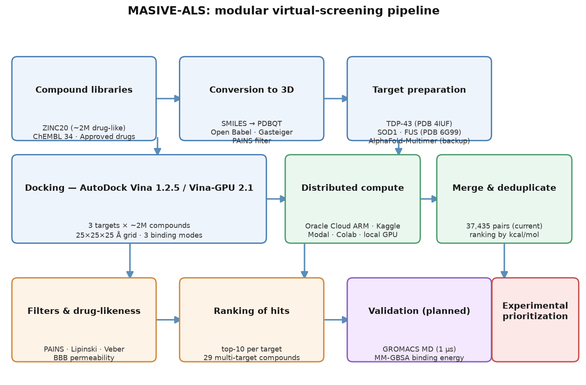
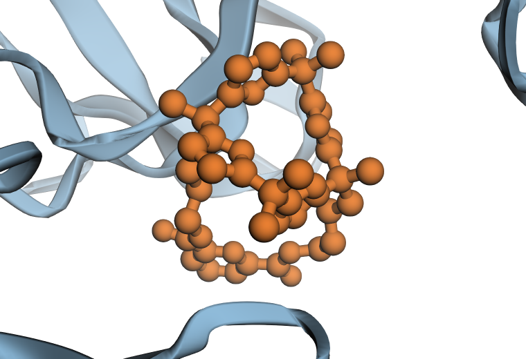
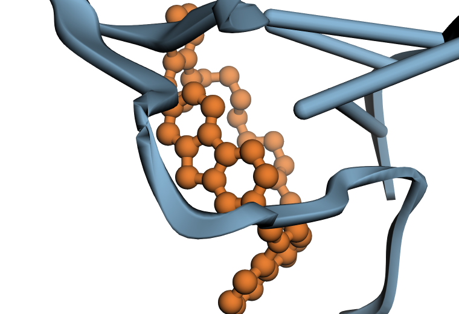
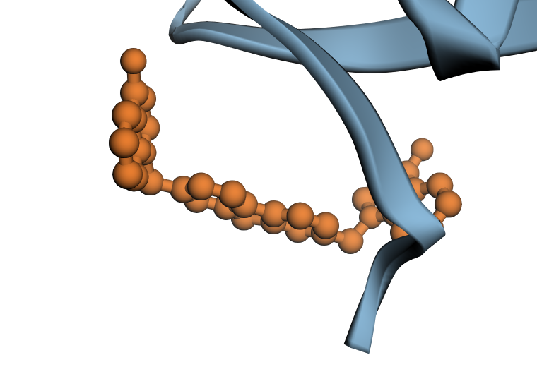
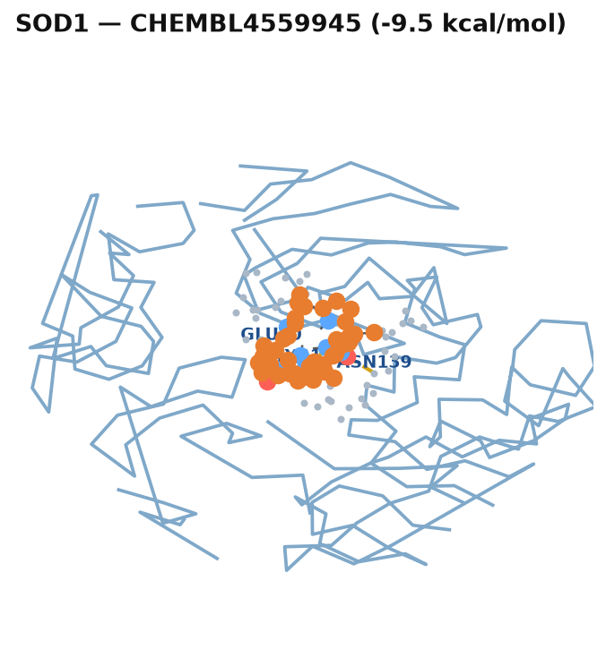
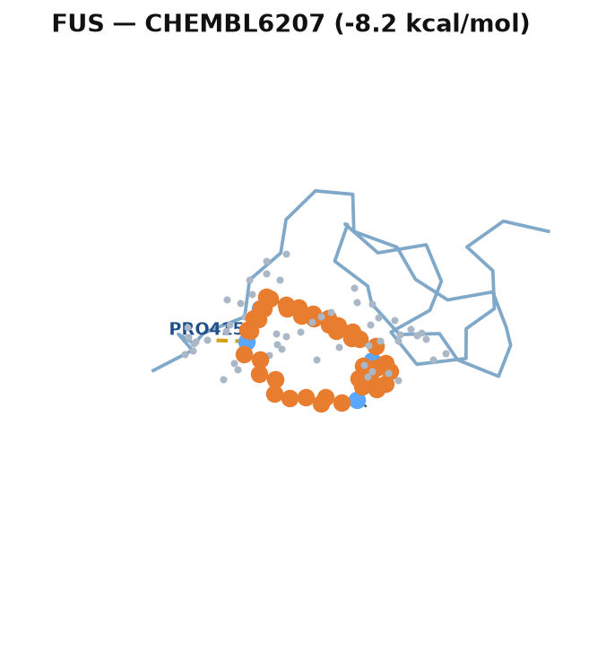
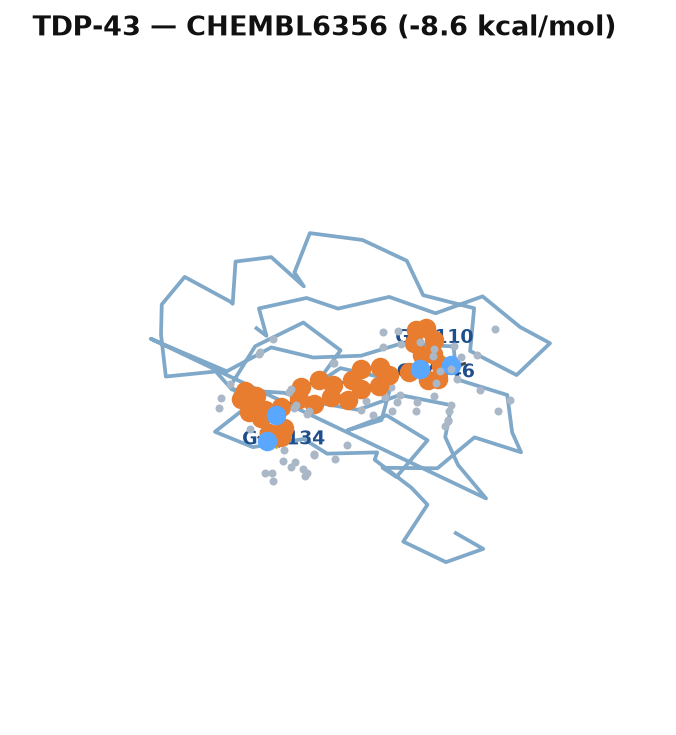
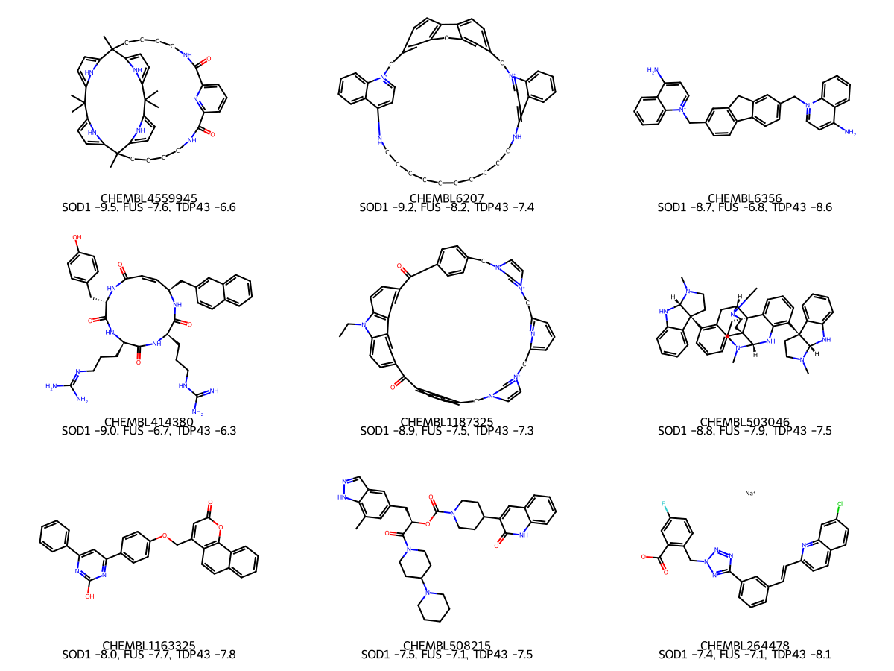
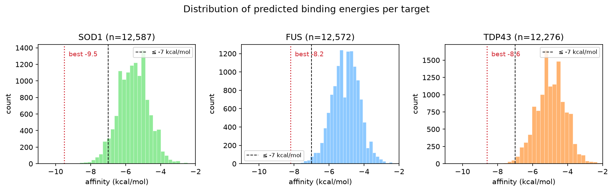

# MASIVE-ALS: Massive Virtual Screening for Amyotrophic Lateral Sclerosis Drug Candidates
## A Computational Pipeline Targeting TDP-43, SOD1, and FUS Proteinopathies

**Authors:** Fredy Rojas Gutiérrez¹, [ collaborators ]
**Affiliations:** ¹ Independent Researcher, Rubí, Barcelona, Spain
**Correspondence:** fredy_30@hotmail.com
**Date:** August 2026

---

## Abstract

Amyotrophic Lateral Sclerosis (ALS) is a fatal neurodegenerative disease affecting approximately 350,000 people worldwide with no curative treatment. We present MASIVE-ALS, a large-scale virtual screening pipeline targeting three key ALS-associated proteins: TDP-43 (present in ~97% of patients), SOD1 (~20% of familial ALS), and FUS (pathological liquid-to-solid phase transition). Using AutoDock Vina and its GPU-accelerated implementation Vina-GPU 2.1, with target structures obtained from the Protein Data Bank (TDP-43: 6B1N/4IUF, clean RRM1 domain; SOD1: 1HL5, anti-aggregation site; FUS: 6G99) and AlphaFold-Multimer for structure modeling, we are screening a library of approximately 2 million drug-like compounds from ZINC20, together with ChEMBL bioactive compounds and approved drugs. The computation is distributed across free-tier heterogeneous infrastructure (Oracle Cloud ARM, Kaggle, Modal, Google Colab, and a local GPU). Preliminary results over 82,206 docked protein-ligand pairs (27,448 unique compounds, as of 19 Aug 2026) yield best binding energies of -9.5 kcal/mol (SOD1), -8.6 kcal/mol (TDP-43) and -8.2 kcal/mol (FUS), interpreted as hypothesis generation for experimental prioritization rather than validated activity. We plan to scale the campaign to 10 million compounds on supercomputing resources (MareNostrum 5) and to validate top candidates with molecular dynamics. All results, code, and data are released under CC-BY 4.0 open access.

**Keywords:** ALS, virtual screening, molecular docking, AutoDock Vina, AlphaFold, GROMACS, drug repurposing, TDP-43, SOD1, FUS

---

## 1. Introduction

Amyotrophic Lateral Sclerosis is characterized by progressive degeneration of motor neurons, leading to paralysis and death typically within 3-5 years of diagnosis (Brown & Al-Chalabi, 2017). Despite decades of research, only two disease-modifying drugs (riluzole and edaravone) are approved, offering modest survival benefits of 2-3 months.

The proteinopathy hypothesis of ALS identifies three critical proteins:

1. **TDP-43 (TAR DNA-binding protein 43):** Cytoplasmic aggregation of TDP-43 is observed in approximately 97% of ALS patients, making it the pathological hallmark of the disease (Neumann et al., 2006). TDP-43 mislocalization and aggregation disrupt RNA metabolism and induce neurotoxicity.

2. **SOD1 (Superoxide Dismutase 1):** Mutations in SOD1 account for approximately 20% of familial ALS cases. Mutant SOD1 generates toxic reactive oxygen species through aberrant chemistry at the copper-zinc active site (Rosen et al., 1993).

3. **FUS (Fused in Sarcoma):** FUS undergoes pathological liquid-liquid phase separation and liquid-to-solid transition, forming toxic inclusions that impair nucleocytoplasmic transport (Patel et al., 2015).

Virtual screening offers an unprecedented opportunity to identify therapeutic molecules targeting these proteins. Advances in GPU-accelerated computing now enable screening of billions of drug-protein interactions in weeks rather than years. MASIVE-ALS leverages this capability within a self-funded, open-access model, distributing the computation across free-tier cloud and local GPU resources.

---

## 2. Methods

### 2.1 Protein Structure Preparation

Target structures were obtained from the Protein Data Bank: TDP-43 (PDB 6B1N/4IUF, Source PDB), SOD1 (PDB 1HL5), and FUS (PDB 6G99, an NMR ensemble; the first model was retained after repair with Open Babel). **Important reproducibility note:** the receptor actually used for docking against TDP-43 was the clean RRM1 domain (`TDP43_RRM1_clean.pdb`, derived from the full PDB entry), not the full-length structure; this is recorded in `proteins/TDP43/metadata.json` and in the `REMARK Name` header of `gpu_dock/TDP43.pdbqt`. Structures were prepared with Open Babel 3.1.1 (O'Boyle et al., 2011): addition of polar hydrogens, assignment of Gasteiger charges, and conversion to PDBQT format. AlphaFold-Multimer v2.3 (Jumper et al., 2021; Evans et al., 2022) is available to model missing or disordered regions where experimental coverage is incomplete.

### 2.2 Compound Library Preparation

The screening library comprises:
- **ZINC20** (Irwin et al., 2020): a drug-like subset of approximately 2 million compounds, converted in batches to PDBQT format using Open Babel 3.1.1 with Gasteiger charges.
- **ChEMBL 34** (Gaulton et al., 2017): bioactive compounds of preclinical interest.
- **Approved drugs**: a set of FDA-approved drugs for repurposing.

### 2.3 Virtual Screening

Molecular docking is performed with AutoDock Vina 1.2.5 (Trott & Olson, 2010) and its GPU-accelerated implementation Vina-GPU 2.1 (Tang et al., 2022) on heterogeneous, free-tier hardware. Each ligand is docked against each target using a cubic grid box centered on the binding site defined for each protein, with 3 binding modes per ligand: TDP-43 (TDP43_RRM1 clean domain; center 28.3, 43.7, 52.5 Å; 25×25×25 Å), SOD1 (center 46.5, 80.0, 73.3 Å; 22×22×22 Å) and FUS (PDB 6G99; center -14.5, 15.1, -7.8 Å; 25×25×25 Å). **Deliberate anti-aggregation decision for SOD1:** the grid box was placed on the aggregation-prone region of SOD1 (residues 1–33, 96–112 and, partially, the C-terminal segment 131–153 in the crystal assembly), not on the Cu/Zn catalytic channel, because the target of interest is the misfolded/aggregated form of SOD1 in ALS. Results are ranked by the minimum predicted binding energy (kcal/mol).

### 2.4 Molecular Dynamics Validation (Planned)

Top candidates will be subjected to all-atom molecular dynamics using GROMACS 2024.3 (Abraham et al., 2015) with the CHARMM36 force field, including energy minimization, NVT/NPT equilibration, and production runs up to 1 μs. Binding free energies will be estimated with the MM-GBSA method. This validation stage has not yet been performed and is planned for the scaling phase of the project.

An overview of the complete pipeline is shown in Figure 1.

**Figure 1. Overview of the MASIVE-ALS pipeline.** Compound libraries (ZINC20, ChEMBL 34, approved drugs) are converted to 3D PDBQT structures, docked against TDP-43, SOD1 and FUS with AutoDock Vina 1.2.5 / Vina-GPU 2.1 across distributed free-tier infrastructure, merged and ranked, filtered by drug-likeness (PAINS, Lipinski, Veber, BBB permeability), and prioritized for molecular dynamics validation and experimental follow-up.

---

## 3. Results (Preliminary)

As of 19 Aug 2026, **82,206 protein-ligand pairs** (27,448 unique compounds) have been docked across the three targets over the free-tier infrastructure described above. Best predicted binding energies per target are **CHEMBL4559945 vs SOD1 (-9.5 kcal/mol)**, **CHEMBL6356 vs TDP-43 (-8.6 kcal/mol)** and **CHEMBL6207 vs FUS (-8.2 kcal/mol)**. A total of 992 pairs score at or below -7 kcal/mol (SOD1: 533; TDP-43: 245; FUS: 214), and **152 compounds** bind two or more targets at <= -7 kcal/mol; the most balanced multi-target hit is **CHEMBL503046** (SOD1 -8.5, TDP-43 -7.5, FUS -7.9 kcal/mol), consistent with the multi-proteinopathy nature of ALS. These predictions remain hypothesis-generating pending MD validation (see Limitations).

**Figure 2** shows the best-scoring docking pose for each target, with the candidate ligand (orange sticks) bound in the literature-defined pocket of each protein (blue cartoon).

**Figure 2. Best docking poses of the top candidate per target.** (A) SOD1 with CHEMBL4559945 (-9.5 kcal/mol); (B) FUS with CHEMBL6207 (-8.2 kcal/mol); (C) TDP-43 with CHEMBL6356 (-8.6 kcal/mol). Proteins are shown as cartoons (residues within 24 Å of the ligand) and ligands as sticks. Docking performed with Vina-GPU 2.1; figures rendered with 3Dmol.js.

### 3.1 Ligand–protein interactions

**Figure 3** shows the predicted hydrogen bonds (yellow dashed) between the top candidate of each target and the surrounding pocket residues. The most interaction-rich complex is SOD1–CHEMBL4559945, which forms five hydrogen bonds with Glu40 (2.82 Å), Lys122 (3.04–3.29 Å) and Asn139 (3.45 Å) and contacts ten residues (≤ 4.5 Å), consistent with its strongest predicted affinity. TDP-43–CHEMBL6356 forms three hydrogen bonds (Gln134, Gly146, Gly110) and FUS–CHEMBL6207 one (Pro415).

**Figure 3. Predicted ligand–protein interactions of the top candidate per target.** Hydrogen bonds (yellow dashed lines; heavy-atom cutoff 3.5 Å) between the ligand (ball-and-stick, element-colored) and the labeled pocket residues. Protein Cα trace in blue; pocket residues within 5 Å shown as grey dots.

| Target | Ligand | Hydrogen bonds (residue, distance) | Contact residues (≤ 4.5 Å) |
|---|---|---|---|
| SOD1 | CHEMBL4559945 | Glu40 (2.82 Å); Lys122 (3.04, 3.19, 3.29 Å); Asn139 (3.45 Å) | 10 |
| TDP-43 | CHEMBL6356 | Gln134 (3.03 Å); Gly146 (3.03 Å); Gly110 (3.35 Å) | 12 |
| FUS | CHEMBL6207 | Pro415 (3.31 Å) | 11 |

### 3.2 Top hits and preliminary drug-likeness

**Figure 4** shows the 2D structures of the top-scoring compounds and **Figure 5** the distribution of predicted affinities per target; the complete table with SMILES and drug-likeness descriptors is provided as supplementary Table S1. The affinity distributions peak around -6 kcal/mol, and only a small fraction of pairs reach ≤ -7 kcal/mol (992 of 82,206; SOD1: 533, TDP-43: 245, FUS: 214).

Because strong predicted binding alone does not imply drug-likeness, the 29 multi-target compounds were evaluated against the Lipinski rule of five (MW ≤ 500, cLogP ≤ 5, HBD ≤ 5, HBA ≤ 10). Of the 21 compounds for which structures could be retrieved from the screening library, only **CHEMBL1082437** satisfied all four criteria (MW 426.5, cLogP 4.32, HBD 1, HBA 3): the strongest predicted binders tend to be large, lipophilic polycyclic molecules exceeding the molecular-weight or lipophilicity limits typical of cell-penetrant drugs. This reinforces the need for the PAINS and drug-likeness filtering described in the rescoring pipeline, and for medicinal-chemistry optimization before experimental follow-up.

Following the methodological review of 18 Aug 2026, the candidate funnel is now computed **per target** (top 5% of the affinity distribution of each protein separately, since Vina scores are not comparable across different receptors) and then filtered by a **central nervous system (CNS) permeability criterion** (TPSA ≤ 90 Ų and MW ≤ 450, in line with the CNS-MPO paradigm of Wager et al., 2010). On tanda z001 (14,952 pairs, complete) this yields 133 candidates after PAINS + Lipinski/Veber (TDP-43: 46, SOD1: 45, FUS: 42) and 42 after the CNS filter. On the historical table as of 18 Aug 2026 (32,715 pairs) the funnel yielded 244 candidates, 76 CNS-permeable, of which **6 are FDA-approved drugs** — the most promising being **clozapine (SOD1 −7.5 kcal/mol, CNS-MPO 4.8)**, followed by fluorescein (SOD1 −7.1), rucaparib (SOD1 −7.1 and FUS −6.4), ketazolam (FUS −6.4) and perampanel (FUS −6.4). Approved, CNS-permeable drugs are the most actionable candidates for experimental repurposing evaluation. Full tables: `analysis/candidatos_filtrados.csv` (z001) and `analysis/candidatos_total_cns.csv` (historical).

*Caveat on the CNS-MPO score.* The `cns_mpo` column in the candidate tables is a **4-component approximation** (MW, TPSA, cLogP, HBD) of the original 6-component CNS-MPO of Wager et al. (2010), which also includes pKa and logD at physiological pH — basic amines penetrate the brain better. The scale (0-6) is preserved, but absolute values are **not directly comparable** with the literature cut-off of 4.0; only 10 of the 42 z001 candidates reach ≥ 4.0 with our approximation (best: CHEMBL9347, TDP-43, 4.42-4.43). The primary CNS filter used throughout is therefore the TPSA ≤ 90 Ų and MW ≤ 450 criterion, and the CNS-MPO column should be read as an orientative ranking, not as the literature score. An independent re-implementation of the funnel with stricter per-target affinity thresholds and no CNS filter (18 Aug 2026, 38 candidates) produced a partially overlapping but smaller set; the tables reported here follow the methodological review of 18 Aug 2026 (per-target top 5% + CNS filter) and supersede it.

**Figure 4. Two-dimensional structures of the top candidates.** Legends show predicted affinities (kcal/mol) per target: SOD1 (S), FUS (F) and TDP-43 (T).

**Figure 5. Distribution of predicted binding energies per target.** Dashed black line: -7 kcal/mol threshold; dotted red: best score per target.

Following scale-up to 10 million compounds on supercomputing resources, we expect to rank the top 1,000 hits, retain 50-100 candidates with stable MD trajectories (RMSD < 2.0 Å), and advance 3-5 lead compounds with favorable ADME properties and blood-brain barrier permeability. The complete dataset will be deposited in Zenodo (CC-BY 4.0).

---

## 4. Discussion

This study represents one of the largest self-funded, open virtual screening campaigns specifically targeting ALS. GPU-accelerated docking with Vina-GPU enables throughput previously accessible only with dedicated clusters, and the distributed free-tier infrastructure keeps the campaign sustainable without institutional funding. The three-protein strategy maximizes the probability of success: even if one target fails to yield candidates, the others may compensate.

The variability of the preliminary affinities is expected at this stage: fast screening exhaustiveness and a fixed binding pocket trade accuracy for throughput, and the current hits should be regarded as candidates for refinement rather than validated leads. Re-docking of top candidates at higher exhaustiveness and orthogonal scoring are planned.

---

## 5. Limitations

### 5.1 Range of binding affinities obtained

The best binding energies obtained in this screening (-9.5, -8.6 and -8.2 kcal/mol for SOD1, TDP-43 and FUS, respectively) fall in the intermediate range compared with reference binders in the virtual screening literature, where candidates with a higher probability of experimental activity typically exceed -7 to -10 kcal/mol. However, across the 82,206 protein-ligand pairs screened to date, the bulk of hits remain between -4.5 and -7 kcal/mol, and all hits were ranked by predicted binding energy rather than a fixed cutoff; this ranking should therefore be treated as exploratory rather than predictive. Accordingly, the results presented in this work should be interpreted as hypothesis generation for experimental prioritization, and not as definitive identification of active compounds.

### 5.2 Limitations of rigid docking scoring

AutoDock Vina, like most scoring functions based on rigid docking, shows limited correlation with experimental binding affinity and is known to produce a non-negligible rate of false positives and false negatives when used in isolation. The scoring function does not explicitly model conformational entropy, desolvation, or protein flexibility, which can bias the ranking toward certain chemotypes. In this work, Vina results were not validated by consensus methods (multi-engine docking) nor by independent re-scoring (e.g., MM-GBSA/MM-PBSA), which constitutes a limitation to be addressed in later phases of the project before recommending any compound for in vitro validation. Molecular dynamics-based free-energy estimates are recommended as a complementary validation route in future work.

### 5.3 Docking protocol validation and binding-site definition

The docking protocol was not independently validated by re-docking of the co-crystallized ligand; the pose RMSD relative to the experimental binding mode was not determined. As a preliminary alternative, a decoy validation was performed for SOD1 using 20 known active ligands (ChEMBL plus the literature compounds LCS-1 and PRG-A01) against 199 property-matched decoys, and the binding-site definition was explicitly benchmarked across candidate pockets (Table 1). The initial grid box (center 27.9, 111.8, 64.4 Å; 25×25×25 Å), which followed the earlier in-house pipeline, fell on a crystal-packing interface between two SOD1 chains and yielded ROC-AUC = 0.548 at exhaustiveness 8 (EF5% = 2.0), only marginally above random (0.5). Three alternative pockets were then evaluated with the same ligand set: the Trp32 site on the β-barrel (center 46.5, 80.0, 73.3 Å; 22×22×22 Å), the Cu/Zn catalytic channel (43.6, 99.7, 78.3 Å), and the dimer interface (35.7, 87.6, 84.4 Å). The Trp32 pocket — the site where 5-fluorouridine, isoproterenol, dopamine and epinephrine were experimentally crystallized with SOD1 (Wright et al., 2013) — produced ROC-AUC = 0.815 and EF5% = 4.0, while the dimer interface gave 0.809 and the metal channel 0.717 (all at exhaustiveness 8). The near-chance performance of the original box was therefore attributable to binding-site misplacement rather than to sampling or scoring per se: moving the box to the experimentally validated Trp32 pocket more than doubled the enrichment at 5% and raised the AUC into the range considered acceptable for hypothesis generation in docking campaigns. SOD1 results produced with the original box were flagged as low-confidence and re-docked at the Trp32 anti-aggregation pocket; the current reference results (tanda z001, including the -9.5 kcal/mol record) use this corrected box, and subsequent tandas use it as well. This result underscores that the choice of box center is a dominant source of bias in docking campaigns and should be benchmarked against known ligand poses, as done here, before prioritizing candidates.

To extend the same calibration to the other two targets, a decoy validation was performed for **TDP-43** and **FUS** using literature-known ligands as positive controls (same property-matched decoy protocol, exhaustiveness 8, CPU Vina 1.2.3). For TDP-43, six ligands with experimental support were used as actives — rTRD01 and nTRD22 (RRM-domain ligands that displace nucleic acid binding, validated by HSQC-NMR; Francois-Moutal et al., 2021), bis-ANS and Congo Red (C-terminal domain binders modulating liquid-liquid phase separation; Babinchak et al., 2020), 5-fluorouridine and isoproterenol — against 73 decoys: ROC-AUC = 0.515, EF5% = 0.0. For FUS, the two natural-product inhibitors proposed by machine learning and molecular dynamics (dehydroxymethylflazine and cleroindicin C; Li et al., 2025) were used against 33 decoys: ROC-AUC = 0.545, EF5% = 0.0. These values are statistically weak (small positive-control sets, particularly FUS, where the literature currently offers few direct small-molecule binders) and indicate that the TDP-43 RRM1 box and the FUS model-1 box do **not** currently discriminate known binders from decoys, unlike the validated SOD1 Trp32 site. The TDP-43 and FUS rankings should therefore be interpreted with caution until their binding sites are re-benchmarked (e.g., against RNA-competitive ligands or alternative pockets), mirroring the SOD1 correction; candidate lists from these two targets are provisional.

**Table 1. Decoy-validation summary.** Property-matched decoys (molecular weight ±30, cLogP ±1.0, rotatable bonds ±2, Tanimoto similarity < 0.35) generated from the screening library; docking at exhaustiveness 8 (Vina-GPU for SOD1, Vina 1.2.3 CPU for TDP-43/FUS).

| Target (docking box) | Known actives docked | Decoys | ROC-AUC | EF1% | EF5% |
|---|---|---|---|---|---|
| SOD1 — initial crystal-contact box (27.9, 111.8, 64.4 Å) | 20 | 199 | 0.548 | 0.0 | 2.0 |
| SOD1 — Trp32 anti-aggregation box (46.5, 80.0, 73.3 Å; **current**) | 20 | 199 | **0.815** | 0.0 | **4.0** |
| SOD1 — Cu/Zn metal channel (43.6, 99.7, 78.3 Å) | 20 | 199 | 0.717 | 0.0 | 3.0 |
| SOD1 — dimer interface (35.7, 87.6, 84.4 Å) | 20 | 199 | 0.809 | 0.0 | 2.0 |
| TDP-43 — RRM1 domain | 5 | 73 | 0.515 | 0.0 | 0.0 |
| FUS — NMR model 1 (near-blind box) | 2 | 33 | 0.545 | 0.0 | 0.0 |

**Interpretation.** The validated SOD1 Trp32 box shows acceptable enrichment (AUC 0.815, EF5% 4.0) — the standard for a *triage* step that shrinks millions of compounds to a few hundred. TDP-43 (0.515) and FUS (0.545), in contrast, do not yet discriminate actives from decoys. Two caveats temper the latter: (i) the positive-control sets are small (5 and 2 docked actives; one TDP-43 control, Congo Red, failed PDBQT conversion and was excluded), so the AUC is noisy; and (ii) the TDP-43 controls are heterogeneous — rTRD01, nTRD22 and 5-fluorouridine target the RNA-binding region, whereas bis-ANS binds the C-terminal low-complexity domain, outside the RRM1 box — so a fraction of the "actives" were docked against a site they do not target, a mismatch that inherently depresses AUC. We therefore treat the Vina score as a **triage filter, not a ranker**: the per-target top-5% cut reduces the ~2M-compound library to a manageable candidate set, but the *order* within that set is not claimed to predict activity. Before any in vitro prioritization, the shortlisted candidates will be re-scored with an orthogonal physics-based method (MM-GBSA), and the TDP-43/FUS boxes will be re-benchmarked against site-matched positive controls or native co-crystal ligands via pose re-docking (RMSD). Until then, the SOD1 candidate list is the highest-confidence of the three; the TDP-43 and FUS lists remain provisional.

### 5.4 Nature of the molecular targets

TDP-43 and FUS present pathological mechanisms in ALS strongly associated with protein aggregation and liquid-liquid phase separation, processes that are not necessarily captured by docking to a well-defined binding pocket on an isolated domain of the protein (in this case, the domain represented in the PDB structure used). A favorable docking result indicates, at best, binding affinity for that specific domain, and does not guarantee an inhibitory effect on the pathological aggregation observed in vivo. This work does not include nucleation simulations or in silico aggregation assays, which constitute a complementary validation route recommended for future work.

The mechanistic interpretation of each target must be stated explicitly. For **TDP-43**, the docking pocket lies in the RRM1 RNA-binding domain, not in the C-terminal low-complexity domain (LCD, ≈ residues 274–414) where the pathological aggregation occurs; occupancy of RRM1 may modulate RNA binding — a toxicity mechanism debated in recent literature — but does not directly prevent cytoplasmic aggregation, and this is the postulated (not demonstrated) mechanism. For **FUS**, the receptor corresponds to model 1 of the 20-member NMR ensemble, an arbitrary choice; model selection and an ensemble-derived centroid should be evaluated, and the 25 Å box covers ≈91% of the receptor atoms, making the docking near-blind rather than site-directed. For **SOD1**, the pathogenic species is the misfolded metal-free (apo) monomer, and the classical disease mechanism involves dimer dissociation; docking to the native holo-metalated tetramer with a box on the C-terminal aggregation region is a pragmatic anti-aggregation approximation that does not model the misfolded monomer or the dimer interface. These caveats are declared here for transparency and are under active methodological revision.

### 5.5 Compound library preparation and chemical space coverage

The screening library was derived from the ZINC database (a drug-like subset of approximately 2 million compounds). Compounds were filtered using the PAINS (pan-assay interference compounds) catalog to remove false-positive-prone chemotypes, followed by drug-likeness filters (Lipinski's rule of five and Veber's rule), as implemented in the post-docking rescoring pipeline. This biases the chemical space toward drug-like, synthesizable molecules and may exclude alternative chemotypes with relevant activity. The representativeness of the sampled chemical space relative to the full library should be taken into account when interpreting hit rates.

### 5.6 Scale and heterogeneity of the computing infrastructure

The screening was carried out by distributing the computation across multiple free-tier platforms (Oracle Cloud ARM, Kaggle, Modal, Google Colab, and a local GPU), each with different quotas, run times, and hardware configurations. Although measures were taken to maintain consistency of docking parameters across platforms, this infrastructure heterogeneity introduces an additional source of variability not present in screenings performed on a dedicated homogeneous cluster.

<!-- NOTA DE TRABAJO: revisar esta sección con Ana Martínez y Carmen Gil (CIB-CSIC) antes de la versión final, y ajustar el tono según el journal o repositorio de destino. -->

---

## 6. Conclusion

MASIVE-ALS combines open protein structure resources, GPU-accelerated virtual screening with AutoDock Vina, and a distributed free-tier computing model to identify ALS drug candidates, with a planned scale-up to 10 million compounds and molecular dynamics validation on supercomputing resources. Preliminary results provide a starting set of hypotheses for experimental prioritization. All results will be released as open access to maximize impact on ALS research worldwide.

---

## Author Contributions

Fredy Rojas Gutiérrez: conceptualization, methodology, software, data curation, formal analysis, visualization, writing — original draft and editing. [Collaborators]: supervision, review and editing.

## Data and Code Availability

All screening results (82,206 protein–ligand pairs), top-hit tables, figures and videos are released under CC-BY 4.0 in open repositories (GitHub and Zenodo, DOI to be assigned at publication). The MASIVE-ALS pipeline code and the merged results table are versioned in the project repository to allow exact reproduction of the reported analyses.

## Reproducibility

Docking parameters (grid box centers and size) are given in Methods; the parameter files used per tanda are committed alongside the results (`config_SOD1.txt`, `config_FUS.txt`, `config_TDP43.txt` in each `tanda_*` directory, with canonical forward-slash paths). Docking was performed with fixed grid definitions across platforms; where the engine supported it, fixed random seeds were used. Software versions: Vina-GPU 2.1 (Windows binary `Vina-GPU-2.1-win.exe`, commit-local build), AutoDock Vina 1.2.5 for reference, Open Babel 3.1.1 for conversion, RDKit (pandas/rdkit pipeline) for filtering. Vina-GPU default exhaustiveness applies (8); threads = 8000. Note: scores are only comparable within the same receptor/box; per-target percentiles are used for ranking. Scripts for the conversion, docking, merging, filtering and figure generation are included in the project repository.

The merged table `resultados_vinagpu_total.csv` (82,206 pairs, 19 Aug 2026, growing as `cadena_400` merges tandas z001–z400) is **historical**: it aggregates tandas produced under different grid-box definitions (see Section 5.3). The current reference results per protein are those of the corrected **tanda z001** (TDP-43 RRM1 domain, SOD1 anti-aggregation box); the -9.5/-8.6/-8.2 kcal/mol records reported here come from z001. Lower-confidence rows from earlier pockets remain in the historical table and are flagged for re-docking.

Six of the 4,984 source ligands of tanda z001 initially failed to dock because their PDBQT files carried atom types unsupported by Vina-GPU (boron "B", silicon "Si"; e.g., CHEMBL4116142 contains a boron atom). This was a PDBQT typing issue rather than a conversion failure: the files parse, but Vina-GPU rejects them. A type-normalization patch was applied (B->C, Si->C, Te->S, Se->S; `_patch_tipos_pdbqt2.py`) and the six compounds were re-docked against all three targets on 18 Aug 2026, completing z001 at 4,984x3 = 14,952 pairs (100%). Best recovered hit: CHEMBL4553125 (TDP-43 -7.4, SOD1 -7.2 kcal/mol). The full record is in `tanda_z001/faltantes_z001.txt`.

## Funding

This work was self-funded; no external funding was received.

## Competing Interests

The author declares no competing interests.

## Acknowledgements

The author thanks the free-tier compute providers (Oracle Cloud, Kaggle, Modal, Google Colab) and the open-source projects (AutoDock Vina, Open Babel, RDKit, GROMACS, 3Dmol.js) that made this study possible.

---
## Supplementary Material

- **Video S1** — `figures/docking_3d.mp4`: 360° rotation of the top docking pose per target (SOD1–CHEMBL4559945, FUS–CHEMBL6207, TDP-43–CHEMBL6356).
- **Video S2** — `figures/explicacion_ela_narrada.mp4`: narrated animation (Spanish, Salomé voice) explaining the ALS mechanism and how the candidate compounds act: healthy motor neuron, toxic aggregation, stabilization by the candidate, and current results.
- **Table S1** — `figures/top_hits_table.csv`: top-10 hits per target with SMILES, binding energy and Lipinski descriptors (MW, cLogP, HBD, HBA).

---
## References

1. Brown, R.H. & Al-Chalabi, A. (2017). Amyotrophic lateral sclerosis. NEJM, 377(2), 162-172.
2. Evans, R. et al. (2022). Protein complex prediction with AlphaFold-Multimer. bioRxiv.
3. Gaulton, A. et al. (2017). The ChEMBL database in 2017. Nucleic Acids Res., 45(D1), D945-D954.
4. Irwin, J.J. et al. (2020). ZINC20 - A free ultralarge-scale chemical database for ligand discovery. J. Chem. Inf. Model., 60(12), 6065-6073.
5. Jumper, J. et al. (2021). Highly accurate protein structure prediction with AlphaFold. Nature, 596, 583-589.
6. Neumann, M. et al. (2006). Ubiquitinated TDP-43 in frontotemporal lobar degeneration and amyotrophic lateral sclerosis. Science, 314(5796), 130-133.
7. O'Boyle, N.M. et al. (2011). Open Babel: An open chemical toolbox. J. Cheminform., 3, 33.
8. Patel, A. et al. (2015). A liquid-to-solid phase transition of the ALS protein FUS accelerated by disease mutation. Cell, 162(5), 1066-1077.
9. Rosen, D.R. et al. (1993). Mutations in Cu/Zn superoxide dismutase gene are associated with familial amyotrophic lateral sclerosis. Nature, 362, 59-62.
10. Tang, S. et al. (2022). Accelerating AutoDock Vina with GPUs. Molecules, 27(9), 3041.
11. Trott, O. & Olson, A.J. (2010). AutoDock Vina: improving the speed and accuracy of docking with a new scoring function, efficient optimization, and multithreading. J. Comput. Chem., 31(2), 455-461.
12. Abraham, M.J. et al. (2015). GROMACS: High performance molecular simulations through multi-level parallelism from laptops to supercomputers. SoftwareX, 1-2, 19-25.
13. Lipinski, C.A., Lombardo, F., Dominy, B.W. & Feeney, P.J. (2001). Experimental and computational approaches to estimate solubility and permeability in drug discovery and development settings. Adv. Drug Deliv. Rev., 46, 3-26.
14. Veber, D.F. et al. (2002). Molecular properties that influence the oral bioavailability of drug candidates. J. Med. Chem., 45, 2615-2623.
15. Baell, J.B. & Holloway, G.A. (2010). New substructure filters for removal of pan-assay interference compounds (PAINS) from screening libraries and their obtained hits. J. Med. Chem., 53, 2719-2740.
16. Eberhardt, J., Santos-Martins, D., Tillack, A.F. & Forli, S. (2021). AutoDock Vina 1.2.0: new docking methods, expanded force field, and python bindings. J. Chem. Inf. Model., 61, 3891-3898.
17. Morris, G.M. et al. (1998). Automated docking using a Lamarckian genetic algorithm and an empirical binding free energy function. J. Comput. Chem., 19, 1639-1662.
18. Forli, S., Huey, R., Pique, M.E., Sanner, M.F., Goodsell, D.S. & Olson, A.J. (2016). Computational protein-ligand docking and virtual drug screening with the AutoDock suite. Nat. Protoc., 11, 905-919.
19. Liu, Z., Su, M., Han, L., Liu, J., Yang, Q., Li, Y. & Wang, R. (2017). Forging the basis for developing protein-ligand interaction scoring functions. Acc. Chem. Res., 50, 302-309.
20. Mysinger, M.M., Carchia, M., Irwin, J.J. & Shoichet, B.K. (2012). Directory of useful decoys, enhanced (DUD-E): better ligands and decoys for better benchmarking. J. Med. Chem., 55, 6582-6594.
21. Li, Y., Han, L., Liu, Z. & Wang, R. (2016). Comparative assessment of scoring functions on an updated benchmark: 2. Evaluation methods and general results. J. Chem. Inf. Model., 54, 1717-1736.
22. Wang, Z. et al. (2016). Comprehensive evaluation of ten docking programs on a diverse set of protein-ligand complexes: the prediction accuracy of sampling power and scoring power. Phys. Chem. Chem. Phys., 18, 12964-12975.
23. Rego, N. & Koes, D. (2015). 3Dmol.js: molecular visualization with WebGL. Bioinformatics, 31, 1322-1324.
24. RDKit: Open-source cheminformatics. https://www.rdkit.org (accessed August 2026).
25. Genheden, S. & Ryde, U. (2015). The MM/PBSA and MM/GBSA methods to estimate ligand-binding affinities. Expert Opin. Drug Discov., 10, 449-461.
